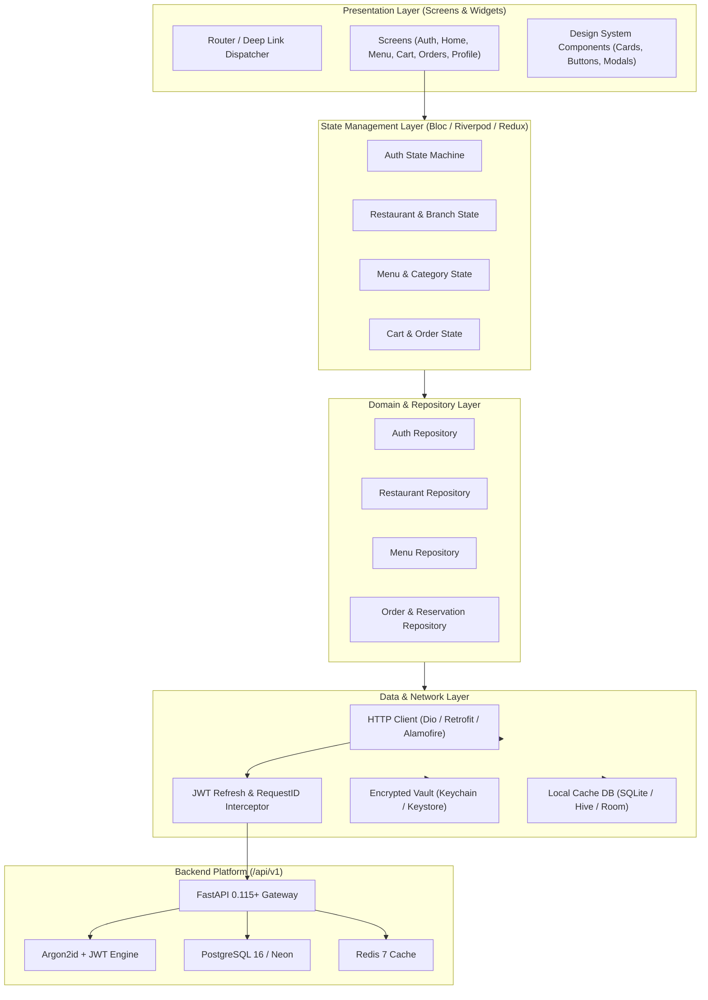
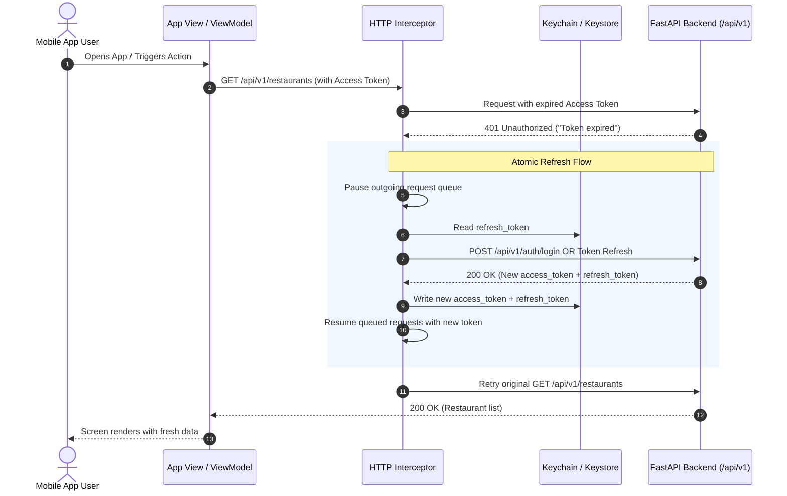
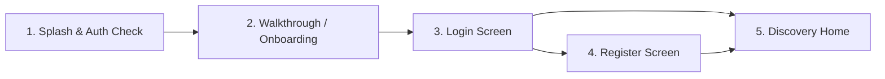
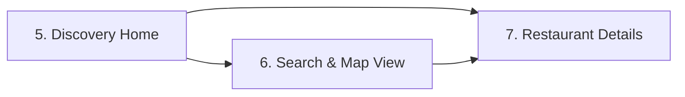
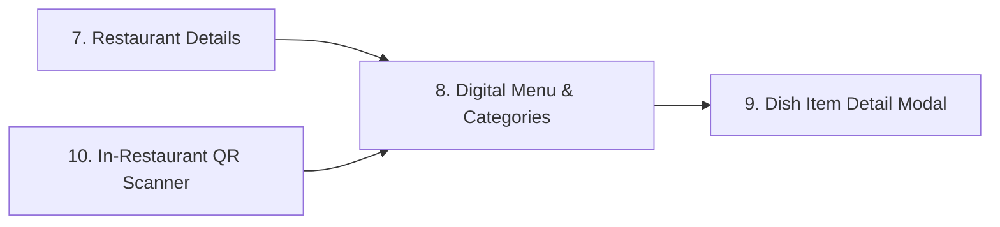
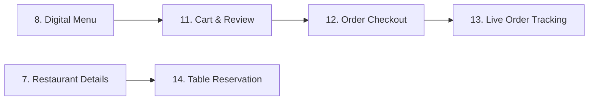
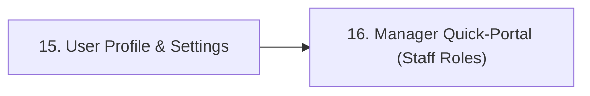

# Mobile Application Architecture & Backend Integration Plan (iOS & Android)

> **Document Version**: 1.0.0  
> **Target Audience**: Mobile Engineers (Flutter / React Native / Native Swift & Kotlin), Backend Engineers, Product Designers  
> **Backend Base Path**: `/api/v1`  
> **Compatible Backend Core**: FastAPI 0.115+, PostgreSQL 16+ (Docker & Neon Serverless), Redis 7

---

## 1. Executive Summary & Mobile Architecture Blueprint

This document is the end-to-end integration and architectural blueprint for the cross-platform (iOS and Android) mobile application consuming the Restaurant Platform Backend. 

The application is structured to deliver:
1. **Customer Experience**: Restaurant discovery, branch location maps, digital menus, allergen/dietary filters, QR-based in-restaurant ordering, table reservations, cart management, and real-time order tracking.
2. **Staff / Manager Quick-Portal**: Operational dashboards for viewing incoming orders, flipping table statuses, toggling menu item 86/availability, and modifying restaurant metadata.
3. **Robust Mobile Engineering**: Dual-token JWT lifecycle (automatic refresh interception), offline-first caching, resilient network handling, optimistic UI state updates, and biometric authentication.

### 1.1 High-Level Mobile Client Architecture



---

## 2. Environment Setup, Networking & Base Specifications

### 2.1 Base URLs and Network Environments

Mobile devices require different connection endpoints depending on whether they run on physical devices or emulators:

| Environment | Platform / Device | Base URL | Notes |
|---|---|---|---|
| **Local Dev** | Android Emulator | `http://10.0.2.2:8000/api/v1` | `10.0.2.2` maps directly to host `localhost` |
| **Local Dev** | iOS Simulator | `http://127.0.0.1:8000/api/v1` | Shares host network loopback |
| **Local Dev** | Physical Device (WiFi) | `http://<YOUR_LOCAL_IP>:8000/api/v1` | Device must be on the same local network subnet |
| **Staging** | iOS & Android | `https://staging-api.yourrestaurantapp.com/api/v1` | Cloud deployment (SSL enforced) |
| **Production** | iOS & Android | `https://api.yourrestaurantapp.com/api/v1` | Cloud deployment (Neon DB + Redis cache) |

### 2.2 Global HTTP Headers

Every request from the mobile client must inject:
```http
Content-Type: application/json
Accept: application/json
X-Client-Platform: iOS | Android
X-Client-Version: 1.0.0
X-Request-ID: <UUIDv4>   # Client-generated correlation ID for end-to-end tracing
```

When authenticated:
```http
Authorization: Bearer <access_token>
```

### 2.3 Global Error Handling & Schema

The backend guarantees a standardized error response across all 4xx and 5xx statuses:

```json
{
  "error": {
    "code": 404,
    "message": "Restaurant not found.",
    "request_id": "b3e0cf55-a0c5-4d0f-b258-299e46a1df8a"
  }
}
```

For HTTP 422 (Validation Errors from Pydantic):
```json
{
  "error": {
    "code": 422,
    "message": "Validation Error",
    "details": [
      {
        "type": "string_too_short",
        "loc": ["body", "password"],
        "msg": "String should have at least 8 characters",
        "input": "short"
      }
    ],
    "request_id": "89ec0f41-0f46-4ef3-a3d8-db7926ba5d39"
  }
}
```

**Mobile Error Handler Contract**:
- If `code == 422` and `details` exists: parse the field names in `loc[1]` and attach the corresponding `msg` directly to the input fields on the screen.
- If `code == 401`: trigger token renewal interceptor (see Section 3).
- If `code == 403`: present an unauthorized alert or restrict action according to user role.
- If `code >= 500`: display a non-blocking toast or retry modal with the `request_id` for customer support assistance.

---

## 3. Authentication, Authorization & Security Architecture

### 3.1 Token Lifecycle & Storage

The backend issues two JWTs upon login:
- **Access Token**: Short-lived (default: **15 minutes**). Used in the `Authorization: Bearer <token>` header. Contains payload claims:
  - `sub`: User UUID string
  - `role`: Role string (`customer`, `restaurant_staff`, `restaurant_manager`, `restaurant_owner`, `admin`, `super_admin`)
  - `email`: User email address
  - `exp`: Expiration UNIX timestamp
  - `type`: `"access"`
- **Refresh Token**: Long-lived (default: **7 days**). Used solely to renew the access token. Contains payload claims:
  - `sub`: User UUID string
  - `exp`: Expiration UNIX timestamp
  - `type`: `"refresh"`

#### Mobile Secure Storage Guidelines:
- **iOS**: Store tokens in the **iOS Keychain Services** using `kSecAttrAccessibleAfterFirstUnlockThisDeviceOnly`.
- **Android**: Store tokens in **EncryptedSharedPreferences** backed by the **Android Keystore System** (AES-256 GCM).
- **NEVER** save tokens in raw `SharedPreferences`, `NSUserDefaults`, or unencrypted SQLite/Hive/AsyncStorage.

### 3.2 Dual-Token Auto-Refresh Interceptor Sequence



#### Critical Implementation Rule for Mobile Developers:
When multiple simultaneous API requests trigger 401s, the network interceptor **MUST lock and queue** pending requests so only a single token refresh request is dispatched to the backend. Once the new token arrives, all queued requests are replayed with the new token. If the refresh token is invalid or expired, clear the secure storage and navigate the user to the **Login Screen**.

### 3.3 Role-Based Access Control (RBAC) Matrix

The mobile app reads `role` from the decoded JWT claims and `UserResponse.role` to conditionally unlock UI flows:

| App Feature / Screen | Customer | Restaurant Staff | Restaurant Manager | Restaurant Owner / Admin |
|---|:---:|:---:|:---:|:---:|
| Browse Restaurants & Branches | ✅ | ✅ | ✅ | ✅ |
| View Digital Menus & Dishes | ✅ | ✅ | ✅ | ✅ |
| Scan QR Code at Table | ✅ | ✅ | ✅ | ✅ |
| Place Orders & Reserve Tables | ✅ | ❌ (Customer Mode) | ❌ (Customer Mode) | ❌ (Customer Mode) |
| Manage User Profile | ✅ | ✅ | ✅ | ✅ |
| Toggle Item Availability (86 Dish) | ❌ | ✅ | ✅ | ✅ |
| Edit Menu / Categories | ❌ | ❌ | ✅ | ✅ |
| Update Restaurant & Branch Info | ❌ | ❌ | ❌ | ✅ |
| View Platform Metrics / Admin | ❌ | ❌ | ❌ | ✅ |

---

## 4. Mobile Screen Catalog & End-to-End API Mappings

The application consists of 16 core screens categorized into 5 logical user journeys:
1. **Onboarding & Authentication Flow**
2. **Restaurant Discovery & Exploration Flow**
3. **Digital Menu, Item Detail & QR In-Dining Flow**
4. **Cart, Checkout & Order Tracking Flow**
5. **User Profile, Preferences & Management Portal**

---

### Journey 1: Onboarding & Authentication Flow



#### Screen 1: Splash & Session Hydration Screen
- **Purpose**: App launch verification, JWT validation, network reachability check, and routing decision.
- **UI Components**:
  - Animated Brand Logo & Spinner.
  - Offline banner if internet is unreachable.
- **API Mapping**:
  - `GET /api/v1/health`: Verify backend liveness.
  - If stored `access_token` exists: `GET /api/v1/users/{current_user_id}`.
- **State Logic**:
  - If tokens exist and user fetch succeeds $\rightarrow$ Route to **Screen 5: Discovery Home**.
  - If tokens are missing or refresh fails $\rightarrow$ Route to **Screen 3: Login Screen** (or Screen 2 if first-time launch).

#### Screen 2: Onboarding & Welcome Walkthrough
- **Purpose**: Introduce digital menu ordering, table reservations, and dietary filters to first-time installs.
- **UI Components**: 3-step carousel, "Get Started" and "Sign In" buttons.
- **API Mapping**: None (pure client presentation).

#### Screen 3: Login Screen
- **Purpose**: Authenticate returning users via email and password.
- **UI Components**:
  - Email input field (with email format validation).
  - Password input with show/hide toggle.
  - "Sign In" CTA button with loading spinner state.
  - "Forgot Password?" link.
  - "Create Account" navigation button.
- **API Mapping**:
  - **Endpoint**: `POST /api/v1/auth/login`
  - **Auth Required**: No (Public)
  - **Request Body**:
    ```json
    {
      "email": "customer@example.com",
      "password": "SecurePassword123!"
    }
    ```
  - **Response Payload (HTTP 200)**:
    ```json
    {
      "access_token": "eyJhbGciOiJIUzI1NiIs...",
      "refresh_token": "eyJhbGciOiJIUzI1NiIs...",
      "token_type": "bearer",
      "expires_in": 900
    }
    ```
- **Post-Login Handling**:
  1. Save `access_token` and `refresh_token` into secure storage.
  2. Parse JWT payload to extract `sub` (`user_id`) and `role`.
  3. Call `GET /api/v1/users/{sub}` to retrieve full user profile (`full_name`, `phone`, `status`).
  4. Persist user session in local state.
  5. Route to **Screen 5: Discovery Home**.

#### Screen 4: Registration Screen
- **Purpose**: Create a new customer or merchant account.
- **UI Components**:
  - Full Name input (min 2 chars).
  - Email input (EmailStr validated).
  - Phone number input with international prefix selector.
  - Password input (min 8 chars, strength indicator).
  - Account Type selector (default: `customer`, optional `restaurant_owner`).
  - Terms & Privacy Policy checkbox.
- **API Mapping**:
  - **Endpoint**: `POST /api/v1/auth/register`
  - **Auth Required**: No (Public)
  - **Request Body**:
    ```json
    {
      "email": "jane.doe@example.com",
      "full_name": "Jane Doe",
      "phone": "+1-555-019-2834",
      "role": "customer",
      "password": "StrongPassword!2026"
    }
    ```
  - **Response Payload (HTTP 201 Created)**:
    ```json
    {
      "email": "jane.doe@example.com",
      "full_name": "Jane Doe",
      "phone": "+1-555-019-2834",
      "role": "customer",
      "id": "c3e80d46-4dc4-4d83-bb5b-38d5f3089d71",
      "status": "active",
      "is_active": true,
      "is_verified": false,
      "created_at": "2026-09-13T20:00:00Z",
      "updated_at": "2026-09-13T20:00:00Z"
    }
    ```
- **Post-Register Flow**: Automatically trigger `POST /api/v1/auth/login` with the newly registered credentials to obtain tokens without requiring the user to re-type them.

---

### Journey 2: Restaurant Discovery & Exploration Flow



#### Screen 5: Restaurant Discovery Home Screen
- **Purpose**: Main landing hub displaying active restaurants, promotions, and quick categories.
- **UI Components**:
  - Top Bar: Location chip ("Current Location"), Search Icon, QR Scanner quick-action icon.
  - Promotional Banner Carousel (top chefs, daily deals).
  - Quick Category Chips: Italian, Sushi, Vegan, Healthy, Fast Casual.
  - Paginated List of Restaurant Cards:
    - Cover image with cached fallback.
    - Restaurant logo thumbnail.
    - Restaurant Name, Slug, Description.
    - Active branches count chip.
    - Status badge (`active`, `closed`).
  - Pull-to-refresh & infinite scroll footer indicator.
- **API Mapping**:
  - **Endpoint**: `GET /api/v1/restaurants`
  - **Query Parameters**:
    - `page`: integer (e.g. `1`)
    - `page_size`: integer (e.g. `10` or `20`)
  - **Auth Required**: Optional (Public accessible)
  - **Response Payload (HTTP 200)**:
    ```json
    {
      "items": [
        {
          "name": "Bella Italia Bistro",
          "slug": "bella-italia-bistro",
          "description": "Authentic wood-fired Italian pizzas and handcrafted pastas.",
          "logo_url": "https://cdn.restaurant.com/logos/bella.png",
          "cover_image_url": "https://cdn.restaurant.com/covers/bella.jpg",
          "id": "11111111-1111-1111-1111-111111111111",
          "status": "active",
          "is_active": true,
          "owner_id": "44444444-4444-4444-4444-444444444444",
          "created_at": "2026-09-01T10:00:00Z",
          "updated_at": "2026-09-01T10:00:00Z",
          "branches": [
            {
              "name": "Downtown Central",
              "address_line": "100 Grand Avenue",
              "city": "Metropolis",
              "state_or_province": "NY",
              "postal_code": "10001",
              "country_code": "US",
              "latitude": 40.7128,
              "longitude": -74.0060,
              "phone": "+1-555-111-2222",
              "id": "22222222-2222-2222-2222-222222222222",
              "restaurant_id": "11111111-1111-1111-1111-111111111111",
              "is_active": true,
              "created_at": "2026-09-01T10:00:00Z",
              "updated_at": "2026-09-01T10:00:00Z"
            }
          ]
        }
      ],
      "total": 42,
      "page": 1,
      "page_size": 20,
      "total_pages": 3
    }
    ```
- **Local Caching**: Store the first page in local SQLite/Room/CoreData cache to render instantly on subsequent app boots even when offline.

#### Screen 6: Search & Branch Interactive Map View
- **Purpose**: Search restaurants by query, filter by city/country, and explore physical branch locations on an interactive Map (Google Maps / Apple Maps).
- **UI Components**:
  - Real-time search bar with debounce (350ms).
  - Map View with custom restaurant map pins.
  - Collapsible bottom-sheet carousel displaying the branch details matching the tapped map marker (Distance, Address, Phone, "View Menu" CTA).
  - Filter chips: Distance `< 5km`, `Open Now`, `Cuisine`.
- **API Mapping**:
  - `GET /api/v1/restaurants?page=1&page_size=50`: Ingest branch coordinates (`latitude`, `longitude`, `city`, `address_line`) and place pins on the map.
  - Client-side filtering calculates Haversine distance from the user's current GPS location to `branch.latitude` and `branch.longitude`.

#### Screen 7: Restaurant Overview & Branches Screen
- **Purpose**: Comprehensive showcase of a specific restaurant, its physical locations, and its menus.
- **UI Components**:
  - Parallax Cover Image header with back button and favorite bookmark toggle.
  - Restaurant Logo, Title, and Description.
  - Branches Card Accordion: Shows branch address, phone dialer button (`tel:<phone>`), and "Navigate with Maps" CTA (`geo:<lat>,<lng>`).
  - Active Menus List: e.g. "Main Dining Menu", "Lunch Specials", "Cocktails & Drinks".
  - "Reserve a Table" bottom bar button.
- **API Mapping**:
  - **By UUID**: `GET /api/v1/restaurants/{restaurant_id}`
  - **By Slug (Deep Link friendly)**: `GET /api/v1/restaurants/by-slug/{slug}`
  - **Fetch Restaurant Menus**: `GET /api/v1/menus/restaurant/{restaurant_id}`
  - **Response Payload (`list[MenuResponse]`)**:
    ```json
    [
      {
        "name": "Summer Dinner Menu",
        "description": "Chef curated seasonal offerings",
        "id": "33333333-3333-3333-3333-333333333333",
        "restaurant_id": "11111111-1111-1111-1111-111111111111",
        "status": "active",
        "is_active": true,
        "created_at": "2026-09-01T12:00:00Z",
        "updated_at": "2026-09-01T12:00:00Z",
        "categories": []
      }
    ]
    ```

---

### Journey 3: Digital Menu, Item Detail & QR In-Dining Flow



#### Screen 8: Digital Menu & Category Tabs Screen
- **Purpose**: Core dining screen displaying categorized food and beverage items with smooth scroll-spy tab navigation.
- **UI Components**:
  - Sticky Top Category Tabs (e.g. Starters $\rightarrow$ Mains $\rightarrow$ Pizzas $\rightarrow$ Desserts $\rightarrow$ Beverages).
  - Floating Cart bar displaying total items and subtotal price when cart is non-empty.
  - Dish Item Card:
    - Dish Image with progressive loading.
    - Dish Name, Calories chip (`calories` kcal), Prep time (`preparation_time_minutes` mins).
    - Description preview (2 lines clamped).
    - Formatted Price: `NUMERIC(10, 2)` formatted with `currency` (e.g. `$18.50`).
    - Quick "Add to Cart" stepper (`+`, `-`, quantity).
    - Sold-out overlay if `is_available == false`.
- **API Mapping**:
  - **Endpoint**: `GET /api/v1/menus/{menu_id}`
  - **Auth Required**: Optional (Public)
  - **Response Payload (Full Hierarchical Tree)**:
    ```json
    {
      "name": "Main Dining Menu",
      "description": "All day dining specials",
      "id": "33333333-3333-3333-3333-333333333333",
      "restaurant_id": "11111111-1111-1111-1111-111111111111",
      "status": "active",
      "is_active": true,
      "created_at": "2026-09-01T12:00:00Z",
      "updated_at": "2026-09-01T12:00:00Z",
      "categories": [
        {
          "name": "Starters & Appetizers",
          "description": "Small plates to share",
          "display_order": 0,
          "id": "aaaaaaaa-aaaa-aaaa-aaaa-aaaaaaaaaaaa",
          "menu_id": "33333333-3333-3333-3333-333333333333",
          "created_at": "2026-09-01T12:00:00Z",
          "updated_at": "2026-09-01T12:00:00Z",
          "items": [
            {
              "name": "Truffle Burrata",
              "description": "Fresh pugliese burrata with black truffle glaze and toasted sourdough.",
              "price": "16.50",
              "currency": "USD",
              "image_url": "https://cdn.restaurant.com/items/burrata.jpg",
              "is_available": true,
              "calories": 480,
              "preparation_time_minutes": 10,
              "id": "bbbbbbbb-bbbb-bbbb-bbbb-bbbbbbbbbbbb",
              "category_id": "aaaaaaaa-aaaa-aaaa-aaaa-aaaaaaaaaaaa",
              "created_at": "2026-09-01T12:00:00Z",
              "updated_at": "2026-09-01T12:00:00Z"
            }
          ]
        }
      ]
    }
    ```

#### Screen 9: Dish Item Detail Modal / Sheet
- **Purpose**: Deep view into a specific dish, including high-res imagery, nutrition, allergens, ingredients, and custom notes.
- **UI Components**:
  - Full-width hero image with swipe-down dismissal.
  - Nutrition & Preparation Badges: Calories (`calories`), Estimated Wait (`preparation_time_minutes`).
  - Special Cooking Instructions text area ("No onions", "Dressing on the side").
  - Quantity counter (`[-] 1 [+]`).
  - Big Bottom CTA: "Add to Order - $16.50".
- **API Mapping**:
  - **Endpoint**: `GET /api/v1/menu-items/{item_id}`
  - **Auth Required**: Optional (Public)

#### Screen 10: In-Restaurant QR Code Scanner Screen
- **Purpose**: Allow in-restaurant diners to scan a physical QR code placed on a dining table to immediately lock in their restaurant, branch, and table number.
- **UI Components**:
  - Camera viewport overlay with alignment crosshairs.
  - Torch toggle button.
  - Manual code input fallback.
- **Deep Link / QR Format Specification**:
  - Standard App Link: `https://app.restaurantplatform.com/scan?r={restaurant_slug}&branch={branch_id}&table={table_number}`
  - Custom URI Scheme: `restaurantapp://table?r={restaurant_slug}&branch={branch_id}&table={table_number}`
- **Flow & Mapping**:
  1. Camera scans and decodes the payload.
  2. Parse `restaurant_slug`.
  3. Dispatch API call: `GET /api/v1/restaurants/by-slug/{slug}`.
  4. Fetch active menu: `GET /api/v1/menus/restaurant/{restaurant.id}`.
  5. Save `{ table_number, branch_id }` in local order session context.
  6. Transition user directly into **Screen 8: Digital Menu** with an in-dining table banner: `"Dining at Table #12 - Downtown Central Branch"`.

---

### Journey 4: Cart, Checkout & Order Tracking Flow



#### Screen 11: Persistent Cart & Order Review Screen
- **Purpose**: Review selected dishes, customize quantities, apply promotional discounts, and review fee breakdowns.
- **UI Components**:
  - List of selected items with price breakdown and delete swipe action.
  - Dining Type Selector: `Dine-In` (with Table Number) vs `Takeaway / Pickup`.
  - Order Note for Kitchen.
  - Subtotal, Estimated Taxes, and Total Calculation.
  - "Proceed to Checkout" CTA button.
- **State Logic**:
  - Cart is maintained in local offline-first persistent store (e.g. Hive/SQLite/CoreData) keyed by `restaurant_id`.
  - Enforces single-restaurant ordering (prompts user to clear cart if items from another restaurant are added).

#### Screen 12: Checkout & Payment Screen
- **Purpose**: Select payment method (Apple Pay, Google Pay, Credit Card), finalize order payload, and dispatch to backend.
- **UI Components**:
  - Native Apple Pay / Google Pay button.
  - Credit Card input form (Stripe Mobile SDK integration).
  - Bill summary.
- **API Mapping (Phase 2 Roadmap)**:
  - **Endpoint**: `POST /api/v1/orders`
  - **Auth Required**: Yes (`Authorization: Bearer <token>`)
  - **Request Body**:
    ```json
    {
      "restaurant_id": "11111111-1111-1111-1111-111111111111",
      "branch_id": "22222222-2222-2222-2222-222222222222",
      "order_type": "dine_in",
      "table_number": "12",
      "special_instructions": "Please bring water first",
      "items": [
        {
          "menu_item_id": "bbbbbbbb-bbbb-bbbb-bbbb-bbbbbbbbbbbb",
          "quantity": 2,
          "unit_price": "16.50",
          "notes": "Extra crispy bread"
        }
      ]
    }
    ```
  - **Stub Verification**: `GET /api/v1/orders` currently verifies backend subsystem readiness (`{"status": "foundation_ready"}`).

#### Screen 13: Live Order Status & Tracking Screen
- **Purpose**: Real-time visualization of kitchen order progress.
- **UI Components**:
  - Stepper indicator reflecting `OrderStatus` enum values:
    1. `PENDING` $\rightarrow$ Order Received
    2. `CONFIRMED` $\rightarrow$ Kitchen Accepted
    3. `PREPARING` $\rightarrow$ Chef Cooking
    4. `READY` $\rightarrow$ Ready for Table Serving or Pickup
    5. `DELIVERED` $\rightarrow$ Completed
  - Estimated ready countdown timer.
  - Digital receipt and summary.
  - "Need Help?" button linking to branch phone.

#### Screen 14: Table Reservation Screen
- **Purpose**: Book a table for future dining at a specific restaurant branch.
- **UI Components**:
  - Branch selection dropdown.
  - Date picker & Guest Party Size counter (1 to 12 guests).
  - Time Slot Grid (e.g. `18:00`, `18:30`, `19:00`, `19:30`, `20:00`).
  - Seating preference selector (Indoor, Outdoor Terrace, Bar, Quiet).
  - "Confirm Reservation" button.
- **API Mapping (Phase 2 Roadmap)**:
  - **Endpoint**: `POST /api/v1/reservations`
  - **Auth Required**: Yes (`Authorization: Bearer <token>`)
  - **Stub Verification**: `GET /api/v1/reservations` confirms foundation readiness.

---

### Journey 5: User Profile, Preferences & Management Portal



#### Screen 15: User Profile, Dietary & Security Settings Screen
- **Purpose**: Account management, personal information updates, dietary preferences, and security settings.
- **UI Components**:
  - User Avatar and Name display.
  - Email (read-only) and Phone Number editor.
  - Role Badge (`customer`, `restaurant_manager`, etc.).
  - Security Section: Biometric login toggle (Face ID / Fingerprint), Change Password.
  - "Log Out" and "Delete Account" buttons.
- **API Mapping**:
  - **Fetch Profile**: `GET /api/v1/users/{user_id}`
  - **Update Profile**:
    - **Endpoint**: `PATCH /api/v1/users/{user_id}`
    - **Auth Required**: Yes (`Authorization: Bearer <token>`)
    - **Request Body**:
      ```json
      {
        "full_name": "Jane Doe Smith",
        "phone": "+1-555-999-8888"
      }
      ```
    - **Response Payload (HTTP 200)**: Updated `UserResponse`.

#### Screen 16: Staff / Manager Operations Portal
- **Purpose**: Operational screen displayed only if `role in ['restaurant_staff', 'restaurant_manager', 'restaurant_owner', 'admin']`.
- **UI Components**:
  - "86 Dish" (Quick Availability Toggle): Instant switch to mark any `MenuItem` as available or sold-out.
  - Quick Price & Item Edit: Adjust price or prep time on the fly.
  - Menu Status Switcher: Toggle between `draft` and `active`.
- **API Mapping**:
  - **Toggle Item Availability / Edit Price**:
    - **Endpoint**: `PATCH /api/v1/menu-items/{item_id}`
    - **Auth Required**: Yes
    - **Request Body**:
      ```json
      {
        "is_available": false
      }
      ```
    - **Response Payload (HTTP 200)**: Updated `MenuItemResponse`.
  - **Update Menu Status**:
    - **Endpoint**: `PATCH /api/v1/menus/{menu_id}`
    - **Request Body**:
      ```json
      {
        "status": "active"
      }
      ```
  - **Admin Metrics Check**: `GET /api/v1/admin/metrics`

---

## 5. Mobile Data Models & TypeScript / Dart Contract Definitions

To ensure strict type safety across Android and iOS codebases, the client data models must mirror the backend Pydantic models. Below are reference data structures (usable in Dart / TypeScript / Kotlin):

```typescript
// ==========================================
// 1. Enums
// ==========================================
export type UserRole = 
  | 'customer' 
  | 'restaurant_staff' 
  | 'restaurant_manager' 
  | 'restaurant_owner' 
  | 'admin' 
  | 'super_admin';

export type UserStatus = 'active' | 'inactive' | 'suspended' | 'pending_verification';
export type RestaurantStatus = 'pending' | 'active' | 'suspended' | 'closed';
export type MenuStatus = 'draft' | 'active' | 'archived';
export type OrderStatus = 'pending' | 'confirmed' | 'preparing' | 'ready' | 'delivered' | 'cancelled';
export type ReservationStatus = 'requested' | 'confirmed' | 'cancelled' | 'completed' | 'no_show';

// ==========================================
// 2. Authentication & User Models
// ==========================================
export interface TokenResponse {
  access_token: string;
  refresh_token: string;
  token_type: string;
  expires_in: number;
}

export interface UserResponse {
  id: string; // UUIDv4
  email: string;
  full_name: string;
  phone: string | null;
  role: UserRole;
  status: UserStatus;
  is_active: boolean;
  is_verified: boolean;
  created_at: string; // ISO 8601 UTC
  updated_at: string; // ISO 8601 UTC
}

// ==========================================
// 3. Restaurant & Branch Models
// ==========================================
export interface RestaurantBranchResponse {
  id: string;
  restaurant_id: string;
  name: string;
  address_line: string;
  city: string;
  state_or_province: string | null;
  postal_code: string | null;
  country_code: string;
  latitude: number | null;
  longitude: number | null;
  phone: string | null;
  is_active: boolean;
  created_at: string;
  updated_at: string;
}

export interface RestaurantResponse {
  id: string;
  name: string;
  slug: string;
  description: string | null;
  logo_url: string | null;
  cover_image_url: string | null;
  status: RestaurantStatus;
  is_active: boolean;
  owner_id: string | null;
  created_at: string;
  updated_at: string;
  branches: RestaurantBranchResponse[];
}

// ==========================================
// 4. Menu & Category Models
// ==========================================
export interface MenuItemResponse {
  id: string;
  category_id: string;
  name: string;
  description: string | null;
  price: string; // Exact decimal representation (e.g. "16.50")
  currency: string;
  image_url: string | null;
  is_available: boolean;
  calories: number | null;
  preparation_time_minutes: number | null;
  created_at: string;
  updated_at: string;
}

export interface MenuCategoryResponse {
  id: string;
  menu_id: string;
  name: string;
  description: string | null;
  display_order: number;
  created_at: string;
  updated_at: string;
  items: MenuItemResponse[];
}

export interface MenuResponse {
  id: string;
  restaurant_id: string;
  name: string;
  description: string | null;
  status: MenuStatus;
  is_active: boolean;
  created_at: string;
  updated_at: string;
  categories: MenuCategoryResponse[];
}

// ==========================================
// 5. Common Pagination & Error Envelopes
// ==========================================
export interface PaginatedResponse<T> {
  items: T[];
  total: number;
  page: number;
  page_size: number;
  total_pages: number;
}

export interface ApiErrorDetail {
  type: string;
  loc: (string | number)[];
  msg: string;
  input?: any;
}

export interface ApiErrorResponse {
  error: {
    code: number;
    message: string;
    details?: ApiErrorDetail[];
    request_id?: string;
  };
}
```

---

## 6. Offline Strategy, Caching & Performance Optimization

Mobile network conditions fluctuate frequently in dining environments (e.g., weak signals inside restaurants, basements). The mobile application must implement the following resilience patterns:

### 6.1 Cache-First Data Policies

```text
┌────────────────────────────────────────────────────────┐
│                   Data Access Layer                     │
└────────────────────────────────────────────────────────┘
                           │
             Check Local Persistent Cache?
            ┌──────────────┴──────────────┐
          [YES]                         [NO]
            │                             │
    Emit Cached Data             Fetch Network API
  (Render screen in <50ms)                │
            │                      Update Cache
      Fetch Network API                   │
  (In background if stale)          Emit Network Data
            │
    Update UI Diff
```

1. **Restaurant Discovery List**: Cache the initial page (`page=1`, `page_size=20`) locally. On app launch, display cached data immediately while firing the network request silently. Update the UI smoothly without layout shifts.
2. **Restaurant Menus**: Menus change infrequently during a dining session. Cache the complete `MenuResponse` tree in local storage keyed by `menu_id`. Cache TTL: **6 hours**.
3. **Image Caching**:
   - Utilize a multi-tiered memory and disk cache (e.g. `CachedNetworkImage` in Flutter, `Coil` in Android Kotlin, `Kingfisher` in iOS Swift).
   - Downscale images to mobile screen dimensions before rendering to minimize heap usage.
   - Display a shimmer placeholder while images load.

### 6.2 Financial Value Precision (`NUMERIC(10, 2)`)
- **CRITICAL**: The backend strictly transmits prices as strings with two decimal places (e.g. `"14.99"`).
- **NEVER** parse money into IEEE 754 floating point numbers (`float` / `double`) on the mobile client. Always parse into exact decimal types (`Decimal` in Dart, `BigDecimal` in Kotlin, `NSDecimalNumber` in Swift) to prevent rounding inaccuracies during cart calculations.

---

## 7. Deep Linking & App Launch Configuration

The mobile app must register Universal Links (iOS) and App Links (Android) to open directly from QR codes and web links:

### 7.1 Android Manifest Configuration (`AndroidManifest.xml`)
```xml
<activity android:name=".MainActivity" android:exported="true">
    <!-- Scheme Deep Link -->
    <intent-filter>
        <action android:name="android.intent.action.VIEW" />
        <category android:name="android.intent.category.DEFAULT" />
        <category android:name="android.intent.category.BROWSABLE" />
        <data android:scheme="restaurantapp" android:host="table" />
    </intent-filter>

    <!-- HTTPS App Link -->
    <intent-filter android:autoVerify="true">
        <action android:name="android.intent.action.VIEW" />
        <category android:name="android.intent.category.DEFAULT" />
        <category android:name="android.intent.category.BROWSABLE" />
        <data 
            android:scheme="https" 
            android:host="app.restaurantplatform.com" 
            android:pathPrefix="/scan" />
    </intent-filter>
</activity>
```

### 7.2 iOS Associated Domains (`Runner.entitlements`)
```xml
<dict>
    <key>com.apple.developer.associated-domains</key>
    <array>
        <string>applinks:app.restaurantplatform.com</string>
    </array>
</dict>
```

---

## 8. Development Roadmap & Implementation Milestones

### Phase 1: Core Foundation & Discovery (Week 1–2)
- [ ] Configure networking client with `X-Request-ID` and logging interceptors.
- [ ] Setup secure storage for tokens in Keychain and Android Keystore.
- [ ] Build **Splash Screen (Screen 1)** and token hydration logic.
- [ ] Implement **Login (Screen 3)** and **Register (Screen 4)** with 422 error field mapping.
- [ ] Implement **Discovery Home (Screen 5)** with paginated restaurant listing and pull-to-refresh.
- [ ] Implement **Restaurant Details & Branches (Screen 7)**.

### Phase 2: Menus, QR Scanning & Cart (Week 3–4)
- [ ] Build **Digital Menu (Screen 8)** with sticky category navigation and dish item cards.
- [ ] Implement **Dish Item Modal (Screen 9)** with nutritional info and special instructions.
- [ ] Build **QR Scanner (Screen 10)** supporting physical table scan deep links.
- [ ] Build **Cart & Order Review (Screen 11)** with local persistent storage and exact Decimal pricing.

### Phase 3: Orders, Profile & Staff Portal (Week 5–6)
- [ ] Integrate **Checkout & Payment (Screen 12)** with Apple Pay & Google Pay stubs.
- [ ] Implement **Live Order Tracking (Screen 13)** with real-time status steps.
- [ ] Implement **User Profile & Settings (Screen 15)** with biometric authentication.
- [ ] Implement **Staff Quick-Portal (Screen 16)** to toggle dish availability (`PATCH /api/v1/menu-items/{item_id}`).
- [ ] End-to-end integration testing against local Docker and Neon PostgreSQL cloud instances.

---

## 9. Developer Verification & Testing Checklist

Before submitting PRs for the mobile app, mobile engineers must verify:
1. **Network Connectivity**: App behaves gracefully when airplane mode is toggled on/off.
2. **Token Refresh**: Let access token expire (or mock 401 response); verify that the app seamlessly refreshes the token and retries pending requests without logging the user out.
3. **Form Errors**: Verify that server 422 validation errors highlight the exact invalid input fields with backend error messages.
4. **QR Code Scanning**: Point camera at a sample QR code with URI `restaurantapp://table?r=bella-italia-bistro&branch=downtown&table=5` and verify that the app loads the correct restaurant menu with the table header badge.
5. **Decimals & Monetary Precision**: Verify all subtotals, tax rates, and prices match exact decimal calculations without floating-point drift.
