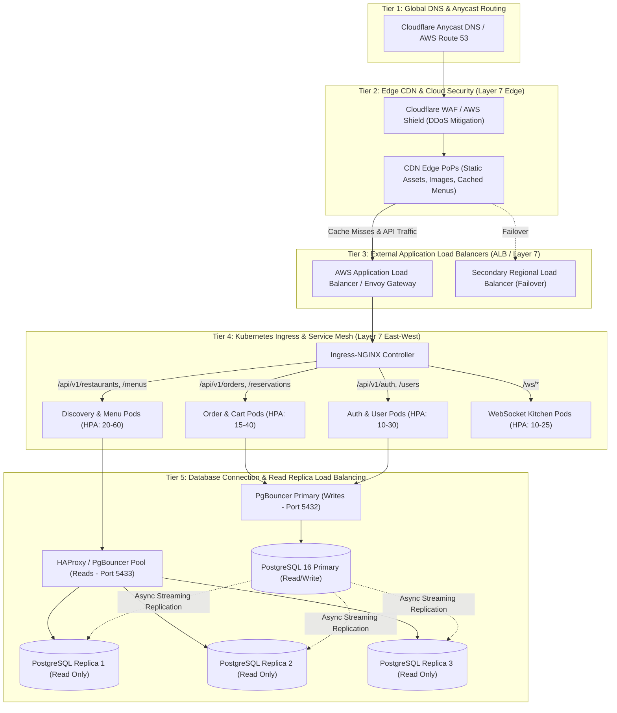

# 1 Million Users: System Scaling & Multi-Tier Load Balancer Architecture Plan

> **Document Version**: 1.0.0  
> **Target Scale**: 1,000,000 Total Users (~100,000–250,000 DAU)  
> **Peak Throughput**: 5,000 – 20,000 Requests Per Second (RPS)  
> **Target Availability**: 99.99% Uptime (< 52.6 minutes downtime/year)  
> **Target Latency**: p95 < 80ms, p99 < 150ms

---

## 1. Executive Summary & Traffic Sizing

Scaling the Restaurant Platform from its current single-container deployment to support **1,000,000 registered users** requires accommodating extreme temporal traffic spikes characteristic of dining apps:
- **Lunch Rush Spikes**: 11:30 AM – 2:00 PM (10x normal load).
- **Dinner Rush Spikes**: 6:30 PM – 9:30 PM (15x normal load).
- **Read-to-Write Ratio**: ~85% Reads (Browsing restaurants, menus, branches, dietary filters) vs ~15% Writes (Cart updates, order creation, payments, table bookings, status transitions).

### 1.1 Sizing Calculations

| Metric | Normal Operation | Peak Dining Rush (Lunch/Dinner) |
|---|---|---|
| **Active Concurrent Users** | 8,000 – 15,000 | 40,000 – 70,000 |
| **API Throughput (RPS)** | 1,500 – 3,000 RPS | 8,000 – 20,000 RPS |
| **Read Queries / Second** | 1,200 – 2,500 QPS | 7,000 – 17,000 QPS |
| **Write Transactions / Second** | 200 – 500 TPS | 1,500 – 3,000 TPS |
| **Active WebSocket Connections** | 2,000 – 5,000 | 25,000 – 50,000 |
| **Network Egress Bandwidth** | 80 Mbps | 450 – 800 Mbps |

---

## 2. Global Multi-Tier Load Balancer Architecture

To eliminate single points of failure (SPOF) and handle up to 20,000 RPS, load balancing is implemented across **5 distinct tiers**:



---

## 3. Detailed Load Balancer Tier Breakdown

### Tier 1: Global DNS & Anycast Routing
- **Provider**: Cloudflare Anycast DNS or AWS Route 53 Geolocation Routing.
- **Functionality**:
  - Routes mobile clients to the nearest regional data center based on client IP latency.
  - Performs health checks every 10 seconds. In the event of a regional outage, automatically swings DNS records to the healthy secondary region within 30 seconds.

### Tier 2: Edge CDN & WAF (DDoS Mitigation & Edge Caching)
- **Technology**: Cloudflare Enterprise / AWS CloudFront + AWS WAF.
- **Responsibilities**:
  1. **DDoS Protection**: Absorbs Layer 3/4 volumetric attacks (SYN floods, UDP reflection) and Layer 7 HTTP floods.
  2. **SSL/TLS 1.3 Termination**: Offloads CPU-intensive TLS handshakes and OCSP stapling from backend application servers.
  3. **Static Edge Caching**:
     - Restaurant logos, cover images, and dish photos cached permanently with `Cache-Control: public, max-age=31536000, immutable`.
     - Static public menu structures cached at the edge for **5 minutes** (`stale-while-revalidate=60`).
  4. **Edge Rate Limiting**:
     - Limits individual client IPs to a maximum of 120 requests/minute on sensitive routes (`/api/v1/auth/login`, `/api/v1/auth/register`) to prevent credential stuffing.

### Tier 3: External Application Load Balancers (L7 Ingress)
- **Technology**: AWS Application Load Balancer (ALB) or Enterprise NGINX / Envoy Gateway.
- **Routing Rules**:
  - **Path-Based Routing**:
    - `/api/v1/auth/*`, `/api/v1/users/*` $\rightarrow$ Target Group: `auth-service`
    - `/api/v1/restaurants/*`, `/api/v1/menus/*`, `/api/v1/menu-items/*` $\rightarrow$ Target Group: `discovery-service`
    - `/api/v1/orders/*`, `/api/v1/reservations/*` $\rightarrow$ Target Group: `order-service`
    - `/ws/*` $\rightarrow$ Target Group: `websocket-service` (Sticky sessions enabled via cookie)
  - **Algorithm**: **Least Outstanding Requests (Least Connections)**. This prevents uneven load distribution caused by long-running queries or slow mobile networks.
  - **Health Checks**:
    - Path: `GET /api/v1/health`
    - Interval: 5 seconds
    - Healthy Threshold: 2 consecutive successes
    - Unhealthy Threshold: 2 consecutive failures
    - Timeout: 2 seconds

### Tier 4: Kubernetes Ingress Controller & East-West Service Mesh
- **Technology**: Ingress-NGINX / Istio Service Mesh.
- **Responsibilities**:
  - Internal service-to-service routing with mutual TLS (mTLS).
  - **Circuit Breaking**: If the Payment Integration or SMS provider fails, Envoy trips the circuit after 5 consecutive 5xx errors, preventing thread starvation in backend pods.
  - Automatic retry with exponential backoff on idempotent `GET` requests.

### Tier 5: Database Connection & Read-Replica Load Balancing
- **Technology**: **HAProxy + PgBouncer**.
- **Problem**: 50 backend pods with 20 connections each would attempt 1,000 direct connections to PostgreSQL, exceeding connection memory limits.
- **Solution**:
  1. **PgBouncer (Transaction Pooling Mode)**:
     - Maintains a lean, persistent pool of **50 physical connections** to PostgreSQL while servicing thousands of concurrent client sessions.
  2. **HAProxy for Read Replicas (Port 5433)**:
     - Balances read queries round-robin across 3 read replicas (`PG_Replica1`, `PG_Replica2`, `PG_Replica3`).
     - Continuously monitors replication lag via PostgreSQL `pg_last_xact_replay_timestamp()`. If any replica lags by more than 5 seconds, HAProxy temporarily drains traffic from it until it catches up.

---

## 4. Production NGINX Load Balancer Blueprint (`nginx.conf`)

Below is the production-tested NGINX configuration for the API Gateway and reverse proxy layer:

```nginx
user nginx;
worker_processes auto;
worker_rlimit_nofile 65535;
pid /var/run/nginx.pid;

events {
    worker_connections 16384;
    use epoll;
    multi_accept on;
}

http {
    include /etc/nginx/mime.types;
    default_type application/octet-stream;

    # Performance Tuning
    sendfile on;
    tcp_nopush on;
    tcp_nodelay on;
    keepalive_timeout 65;
    keepalive_requests 1000;
    reset_timedout_connection on;

    # Gzip Compression
    gzip on;
    gzip_vary on;
    gzip_proxied any;
    gzip_comp_level 5;
    gzip_min_length 256;
    gzip_types application/json text/plain text/css application/javascript;

    # Rate Limiting Zones (Token Bucket Algorithm)
    limit_req_zone $binary_remote_addr zone=api_general:20m rate=100r/s;
    limit_req_zone $binary_remote_addr zone=auth_limit:10m rate=5r/s;
    limit_conn_zone $binary_remote_addr zone=addr_conn:10m;

    # Upstream: Read-Heavy Discovery Service
    upstream discovery_backend {
        least_conn;
        server 10.0.1.101:8000 max_fails=2 fail_timeout=5s;
        server 10.0.1.102:8000 max_fails=2 fail_timeout=5s;
        server 10.0.1.103:8000 max_fails=2 fail_timeout=5s;
        keepalive 64;
    }

    # Upstream: Write-Heavy Orders & Cart Service
    upstream orders_backend {
        least_conn;
        server 10.0.2.101:8000 max_fails=2 fail_timeout=5s;
        server 10.0.2.102:8000 max_fails=2 fail_timeout=5s;
        keepalive 64;
    }

    # Upstream: Real-Time WebSockets (Kitchen & Order Tracking)
    upstream websocket_backend {
        hash $http_x_user_id consistent; # Consistent hashing by user UUID
        server 10.0.3.101:8000;
        server 10.0.3.102:8000;
    }

    server {
        listen 80;
        listen [::]:80;
        server_name api.restaurantplatform.com;
        return 301 https://$host$request_uri;
    }

    server {
        listen 443 ssl http2;
        listen [::]:443 ssl http2;
        server_name api.restaurantplatform.com;

        # SSL Configuration
        ssl_certificate /etc/ssl/certs/api_bundle.crt;
        ssl_certificate_key /etc/ssl/private/api.key;
        ssl_protocols TLSv1.2 TLSv1.3;
        ssl_ciphers ECDHE-ECDSA-AES128-GCM-SHA256:ECDHE-RSA-AES128-GCM-SHA256;
        ssl_prefer_server_ciphers off;
        ssl_session_cache shared:SSL:50m;
        ssl_session_timeout 1d;

        # Security Headers
        add_header X-Frame-Options DENY always;
        add_header X-Content-Type-Options nosniff always;
        add_header Strict-Transport-Security "max-age=31536000; includeSubDomains" always;

        # Proxy Standard Headers
        proxy_http_version 1.1;
        proxy_set_header Connection "";
        proxy_set_header Host $host;
        proxy_set_header X-Real-IP $remote_addr;
        proxy_set_header X-Forwarded-For $proxy_add_x_forwarded_for;
        proxy_set_header X-Forwarded-Proto $scheme;
        proxy_set_header X-Request-ID $request_id;

        # Liveness Health Check (No Rate Limiting)
        location /api/v1/health {
            proxy_pass http://discovery_backend;
            access_log off;
        }

        # Authentication Routes (Strict Rate Limiting)
        location /api/v1/auth/ {
            limit_req zone=auth_limit burst=10 nodelay;
            proxy_pass http://orders_backend;
        }

        # Orders & Payments (Moderate Rate Limiting)
        location /api/v1/orders/ {
            limit_req zone=api_general burst=50 nodelay;
            proxy_pass http://orders_backend;
        }

        # Restaurants & Menus (High Throughput Discovery)
        location /api/v1/restaurants/ {
            limit_req zone=api_general burst=100 nodelay;
            proxy_pass http://discovery_backend;
        }

        # WebSocket Order Tracking
        location /ws/ {
            proxy_pass http://websocket_backend;
            proxy_http_version 1.1;
            proxy_set_header Upgrade $http_upgrade;
            proxy_set_header Connection "Upgrade";
            proxy_read_timeout 3600s;
            proxy_send_timeout 3600s;
        }
    }
}
```

---

## 5. Database HA & Read Replica HAProxy Blueprint (`haproxy.cfg`)

Load balances incoming SQL read requests across PostgreSQL read replicas:

```haproxy
global
    log /dev/log local0
    maxconn 10000

defaults
    log global
    mode tcp
    timeout connect 5000ms
    timeout client 50000ms
    timeout server 50000ms

# ------------------------------------------------------------------------------
# PostgreSQL Read Replicas (Port 5433)
# ------------------------------------------------------------------------------
frontend pg_cluster_reads
    bind *:5433
    mode tcp
    default_backend pg_replicas_pool

backend pg_replicas_pool
    mode tcp
    balance roundrobin
    option tcp-check
    # PostgreSQL TCP Check: checks if replica is active and not lagging
    tcp-check connect port 5432
    server pg_replica_01 10.0.10.21:5432 check fall 2 rise 2
    server pg_replica_02 10.0.10.22:5432 check fall 2 rise 2
    server pg_replica_03 10.0.10.23:5432 check fall 2 rise 2
```

---

## 6. Compute Auto-Scaling & Kubernetes Topology

### 6.1 Horizontal Pod Autoscaler (HPA) Specification

To dynamically scale backend application pods in response to dining rush hours, HPA rules scale the deployments based on both CPU utilization and incoming HTTP request rate:

```yaml
apiVersion: autoscaling/v2
kind: HorizontalPodAutoscaler
metadata:
  name: restaurant-discovery-hpa
  namespace: production
spec:
  scaleTargetRef:
    apiVersion: apps/v1
    kind: Deployment
    name: restaurant-discovery-api
  minReplicas: 10
  maxReplicas: 80
  metrics:
  - type: Resource
    resource:
      name: cpu
      target:
        type: Utilization
        averageUtilization: 65
  - type: Pods
    pods:
      metric:
        name: http_requests_per_second
      target:
        type: AverageValue
        averageValue: "350"
  behavior:
    scaleUp:
      stabilizationWindowSeconds: 0
      policies:
      - type: Percent
        value: 100
        periodSeconds: 15
    scaleDown:
      stabilizationWindowSeconds: 300
      policies:
      - type: Percent
        value: 20
        periodSeconds: 60
```

---

## 7. Distributed Caching & Event Bus Architecture

### 7.1 Redis 7 Sharded Cluster Topology
- **Deployment**: 6 nodes (3 Primaries, 3 Replicas with automatic Sentinel failover).
- **Partitioning Keys**:
  - `menu:{menu_id}`: Cached JSON of the full categories and dish hierarchy.
  - `restaurant:{restaurant_id}`: Cached restaurant profile and branch list.
  - `cart:{user_id}`: Active shopping cart session (persisted in Redis with TTL = 48 hours).
  - `ratelimit:{client_ip}`: Sliding-window rate limit counters.

### 7.2 Event Bus for Asynchronous Decoupling (RabbitMQ / Apache Kafka)
When a diner places an order or reserves a table:
1. `POST /api/v1/orders` writes order with status `PENDING` to PostgreSQL Primary.
2. An `OrderCreatedEvent` is published to Kafka topic `orders.events`.
3. Specialized background workers consume the event without blocking the customer:
   - **Payment Worker**: Dispatches payment authorization to Stripe.
   - **Kitchen POS Worker**: Pushes kitchen order ticket to the restaurant branch POS terminal.
   - **Notification Worker**: Sends Apple Push Notification (APNs) and Android Firebase (FCM) messages.

---

## 8. High Availability, Disaster Recovery & Failover

| Disaster Scenario | Recovery Mechanism | Target RTO (Recovery Time) | Target RPO (Data Loss) |
|---|---|---|---|
| **Pod / Container Crash** | Kubernetes restart policy (`restartPolicy: Always`) replaces pod in < 5 seconds. | < 5 seconds | 0 seconds |
| **Primary Database Node Failure** | Automated PostgreSQL failover promoting the lowest-lag read replica to Primary. | < 30 seconds | < 100 milliseconds |
| **Complete Cloud Availability Zone (AZ) Down** | Multi-AZ deployment: ALB routes traffic exclusively to remaining 2 healthy AZs. | 0 seconds (Instant) | 0 seconds |
| **Complete Regional Outage (e.g. AWS us-east-1)** | Cloudflare DNS automated failover swings traffic to warm standby in `us-west-2`. | < 60 seconds | < 5 seconds |

---

## 9. Phased Implementation Roadmap

```text
Phase 1: Foundation (Current - Up to 10k Users)
├── Monolithic FastAPI on Docker
├── Single PostgreSQL Instance
└── Local Redis 7 Container

Phase 2: HA Architecture & Load Balancing (10k - 100k Users)
├── Deploy AWS ALB / Ingress-NGINX Layer 7 Load Balancer
├── Introduce PgBouncer connection pooling
├── Configure 1 PostgreSQL Read Replica with Read/Write routing
└── Enable Cloudflare CDN for image assets and SSL termination

Phase 3: Micro-Segmentation & Cluster Scaling (100k - 500k Users)
├── Migrate to Kubernetes (EKS / GKE) with HPA (10 to 50 pods)
├── Add PostGIS spatial indexing for instant geographic discovery
├── Implement Redis Cluster (3 Primary / 3 Replica nodes)
└── Deploy Celery / RabbitMQ background worker cluster

Phase 4: 1 Million+ User Scale (500k - 1M+ Users)
├── Deploy 3 dedicated PostgreSQL Read Replicas balanced by HAProxy
├── Deploy Typesense / Elasticsearch cluster for instant dish search
├── Implement Redis-backed WebSockets for live kitchen order tracking
└── Multi-region active-passive disaster recovery configuration
```
