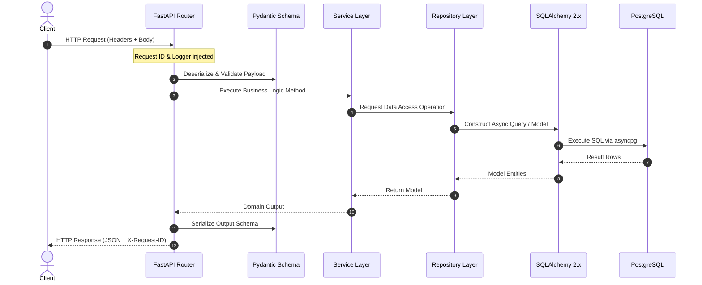

# System Architecture

## 1. High-Level Architecture Overview

The Restaurant Platform uses a clean, layered architecture organized around a centralized asynchronous REST API backend and PostgreSQL database (Neon in production, Docker PostgreSQL in local development).

```mermaid
graph TD
    subgraph Clients
        iOS["iOS Application"]
        Android["Android Application"]
        CustomerWeb["Customer Web App"]
        RestaurantWeb["Restaurant Portal"]
        AdminWeb["Admin Portal"]
    end

    subgraph API Gateway / Ingress
        Uvicorn["Uvicorn ASGI Server"]
        Middleware["Middlewares (Correlation ID, Logging, CORS, Error Handler)"]
    end

    subgraph FastAPI Application
        Routers["FastAPI Routers (/api/v1)"]
        Schemas["Pydantic Schemas (Validation)"]
        Services["Service Layer (Business Logic)"]
        Repos["Repository Layer (Data Access)"]
    end

    subgraph Persistence & Cache
        Postgres[("Neon / PostgreSQL 16")]
        Redis[("Redis 7 (Cache / Session)")]
    end

    subgraph External Integrations (Adapters)
        OpenAI["AI / OCR Menu Ingestion"]
        Stripe["Stripe Payments & Refunds"]
        Maps["Google Maps / Geocoding"]
        Notify["FCM / APNs / Email Notifications"]
    end

    Clients --> Uvicorn
    Uvicorn --> Middleware
    Middleware --> Routers
    Routers --> Schemas
    Schemas --> Services
    Services --> Repos
    Repos --> Postgres
    Services --> Redis
    Services -.-> External Integrations
```

---

## 2. Request Lifecycle & Layered Architecture

To maintain strict separation of concerns, the backend enforces a one-way dependency flow:



---

## 3. Directory Responsibilities

| Layer | Path | Responsibility |
|---|---|---|
| **API Routers** | `app/api/v1/` | Route definitions, parameter binding, dependency injection, and status code mapping. No direct SQL or business logic. |
| **Schemas** | `app/schemas/` | Pydantic models for request deserialization and response serialization. |
| **Services** | `app/services/` | Business workflow orchestration, validation rules, cross-repository operations, and transaction boundaries. |
| **Repositories** | `app/repositories/` | Low-level data access, SQLAlchemy query building, and persistence. |
| **Models** | `app/models/` | Declarative SQLAlchemy ORM entities mapping to database tables. |
| **Core** | `app/core/` | Configuration (`config.py`), security primitives (`security.py`), logging (`logging.py`), and domain constants (`constants.py`). |
| **Integrations** | `app/integrations/` | Abstract interfaces and SDK adapters for third-party systems. |
