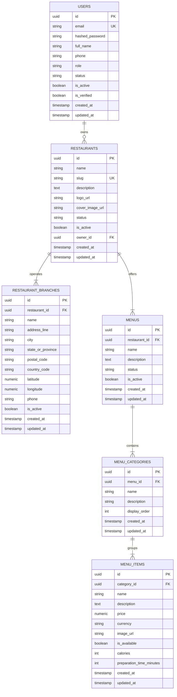

# Database Architecture

## 1. Overview
The database layer is designed for PostgreSQL 16+ and is directly compatible with **Neon PostgreSQL** in cloud deployments.

- **Asynchronous Driver**: `asyncpg` with SQLAlchemy 2.x `AsyncEngine` and `async_sessionmaker`.
- **Migration Framework**: Alembic async runner.
- **Connection Management**: Connection pooling with configured `pool_size` and `max_overflow`.

---

## 2. Core Entity-Relationship Diagram

---

## 3. Database Conventions

1. **Primary Keys**: Every table uses a UUID primary key default generated by `gen_random_uuid()`.
2. **Timestamps**: All tables track `created_at` and `updated_at` in UTC using PostgreSQL `TIMESTAMPTZ`.
3. **Monetary Precision**: Prices and financial values MUST use `NUMERIC(10, 2)`. Never use `FLOAT` or `DOUBLE` for monetary amounts.
4. **Indexes**: Foreign keys, search terms (`name`, `city`), and uniqueness fields (`email`, `slug`) must have explicit btree indexes.
5. **Cascades**: Deleting a restaurant cascades down to its branches and menus. Deleting a user sets `owner_id` to `NULL` to preserve restaurant data continuity.
